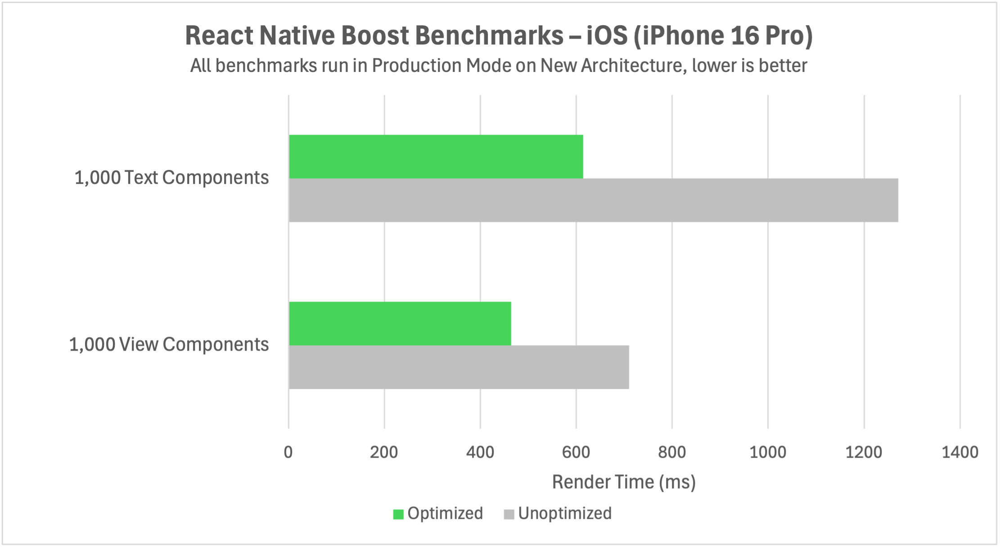

# 🚀 react-native-boost

  

A powerful Babel plugin that automatically optimizes React Native apps through source code analysis and optimization. It identifies safe micro-optimization opportunities, which can lead to significant performance improvements.

> [!WARNING]
> The library and its Babel plugin are still experimental. You should expect things to break. Please report any issues you encounter in the issues tab with reproducible examples, and use the library's ignore mechanisms to disable optimizations for problematic files or lines of code.

- ⚡ Automatic performance optimization through source code analysis
- 🔒 Safe optimizations that don't break your app
- 🎯 Virtually zero runtime overhead
- 📱 Cross-platform compatible
- 🧪 Works seamlessly with Expo
- 🎨 Configurable optimization strategies

## Documentation

The documentation is available at [react-native-boost.oss.kuatsu.de](https://react-native-boost.oss.kuatsu.de).

## Benchmark

The example app in the `apps/example` directory is a benchmark for the performance of the plugin.

<div align="center">
  
</div>

More benchmarks are available in the [docs](https://react-native-boost.oss.kuatsu.de/docs/introduction/benchmarks).

## Installation

Install the package using your favorite package manager. Please **do not** install the package as a dev dependency. While the Babel plugin itself would work as a dev dependency, some optimizations import minimal helpers into your code, which requires the package to be installed as a regular dependency.

```sh
npm install react-native-boost
# or
yarn add react-native-boost
```

Then, add the plugin to your Babel configuration (`babel.config.js`):

```js
module.exports = {
  plugins: ['react-native-boost/plugin'],
};
```

That's it! No imports in your code, pod installing, or anything else is required. Optionally, you can configure the plugin with a few options. See the [documentation](https://react-native-boost.oss.kuatsu.de/docs/babel-plugin/configure) for more information.

## How It Works

A technical rundown of how the plugin works can be found in the [docs](https://react-native-boost.oss.kuatsu.de/docs/introduction/how-it-works).

## Contributing

See the [contributing guide](CONTRIBUTING.md) to learn how to contribute to the repository and the development workflow.

## License

MIT
