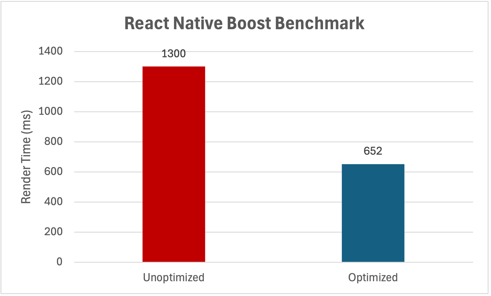

# 🚀 react-native-boost

  

A powerful Babel plugin that automatically optimizes React Native apps through source code analysis and optimization. It identifies safe micro-optimization opportunities, which can lead to significant performance improvements.

> [!WARNING]
> This project is highly experimental and under active development. **Your app might break** and the optimization strategies used can change significantly between versions. Use with caution!

- ⚡ Automatic performance optimization through source code analysis
- 🔒 Safe optimizations that don't break your app
- 🎯 Virtually zero runtime overhead
- 📱 Cross-platform compatible
- 🧪 Works seamlessly with Expo
- 🎨 Configurable optimization strategies

## Benchmark

The example app in the `apps/example` directory is a benchmark for the performance of the plugin.

<div align="center">
  
  <p>
    <b>1,000 Text components</b>: Render time of 1,000 Text components with and without React Native Boost.<br/>
    Measured in milliseconds on an iPhone 16 Pro in development mode, lower is better.
  </p>
</div>

The data is averaged over 10 runs on an iPhone 16 Pro Simulator running the app in development mode.

## Installation

Install the package using your favorite package manager. Please **do not** install the package as a dev dependency. While the Babel plugin itself would work as a dev dependency, some optimizations import minimal helpers into your code, which requires the package to be installed as a regular dependency.

```sh
npm install react-native-boost
# or
yarn add react-native-boost
```

Then, add the plugin to your Babel configuration (`babel.config.js`):

```js
module.exports = {
  plugins: ['react-native-boost/plugin'],
};
```

That's it! No imports in your code, pod installing, or anything else is required.

Optionally, you can configure the plugin to log optimized files to the console and disable specific optimizations:

```js
module.exports = {
  plugins: [
    [
      'react-native-boost/plugin',
      {
        verbose: true,
        optimizations: {
          text: false,
        },
      },
    ],
  ],
};
```

You can also skip optimization for a specific comment using a decorator comment above the component's opening tag:

```jsx
// @boost-ignore
<Text>This will not be optimized.</Text>
```

## How It Works

Several standard components in React Native are actually wrappers around their native counterparts. These wrappers often only handle edge cases and aren't needed in most cases. However, they add additional runtime overhead and depth to the component tree, which can lead to performance bottlenecks.

React Native Boost replaces these wrapper components directly with their respective native components, flattening the component tree. It intelligently analyzes your code and only optimizes components that are used in a way where they can be optimized without breaking the app.

Here's an example of how it works:

```jsx
// Your original code 🐌
import React from 'react';
import { View, Text } from 'react-native';

const MyComponent = () => (
  <View>
    <Text>Hello, World!</Text>
  </View>
);

// Automagically transformed to ✨
import React from 'react';
import { View } from 'react-native';
import { NativeText } from 'react-native/Libraries/Text/TextNativeComponent';

const MyComponent = () => (
  <View>
    <NativeText>Hello, World!</NativeText>
  </View>
);
```

## Contributing

See the [contributing guide](CONTRIBUTING.md) to learn how to contribute to the repository and the development workflow.

## License

MIT
