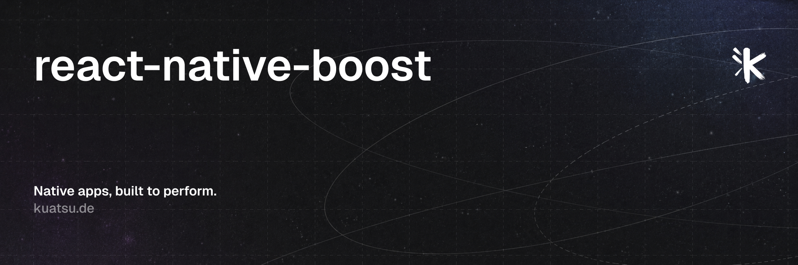
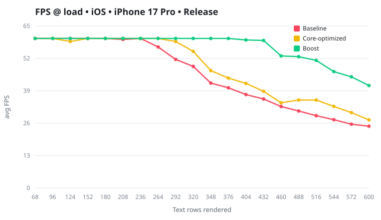

<a href="https://kuatsu.de/?utm_campaign=generic&utm_source=github&utm_medium=referral&utm_content=react-native-boost" align="center">
  <picture>
    
  </picture>
</a>

# react-native-boost

[](https://www.npmjs.com/package/react-native-boost)
[](https://github.com/kuatsu/react-native-boost/actions/workflows/test.yml)
[](LICENSE)

**The React Native performance compiler.**

React Native Boost analyzes your app at build time and automatically applies safe performance optimizations across your React Native code.

It eliminates unnecessary runtime work, replaces JavaScript abstractions with more efficient native equivalents, and fixes common performance pitfalls without requiring you to rewrite your application code.

- ⚡ **Automatic build-time optimization** — improve performance without manually tuning every component
- 🧠 **Static source analysis** — detect optimization opportunities before your app even runs
- 🏗️ **Move runtime work to build time** — precompute and simplify work whenever it can be determined at build time
- 🛠️ **Automatic performance fixes** — correct common performance mistakes when they can be safely transformed
- 🔒 **Safe by default** — optimizations are only applied when behavior can be preserved
- 🪶 **Minimal runtime overhead** — optimizations happen entirely during compilation
- 🧪 **Use with your favorite tools** — fully compatible with most other ecosystem tools including Expo

## Documentation

The documentation is available at [react-native-boost.oss.kuatsu.de](https://react-native-boost.oss.kuatsu.de).

## Benchmark

<div align="center">
  <picture>
    <source media="(prefers-color-scheme: dark)" srcset="./apps/docs/content/docs/information/img/fps-ios.svg" />
    
  </picture>
</div>

See the [benchmarks page](https://react-native-boost.oss.kuatsu.de/docs/information/benchmarks) for Android results and the full methodology.

## Compatibility

| `react-native-boost` | React Native     |
| -------------------- | ---------------- |
| `0.x`                | All versions     |
| `1.x`                | `>=0.83`         |
| `2.x`                | `>=0.83`         |

Current versions of React Native Boost are compatible with **all React Native versions since 0.83**. We test runtime behavior against all of these versions.

For older React Native versions, you can install `react-native-boost@^0`. Please note that we do not support this version anymore and, starting from React Native `0.80`, it prints import deprecation warnings from React Native.

## Installation

Install the package using your favorite package manager. Please **do not** install the package as a development dependency. While the Babel plugin itself would work as a development dependency, it relies on importing the runtime library (`react-native-boost/runtime`) into your code, which requires the package to be installed as a regular dependency. Read more [here](https://react-native-boost.oss.kuatsu.de/docs/runtime-library/).

```sh
npm install react-native-boost
# or
yarn add react-native-boost
```

Then, add Boost to your Metro configuration (`metro.config.js`):

```js
const { getDefaultConfig } = require('expo/metro-config'); // use `@react-native/metro-config` for non-Expo apps
const { withBoostConfig } = require('react-native-boost/metro');

module.exports = withBoostConfig(getDefaultConfig(__dirname));
```

If you don't see the `metro.config.js` file, run this command first:

```sh
npx expo customize metro.config.js
```

If you're using Unistyles, Nativewind, or a bundler other than Metro, see the [documentation](https://react-native-boost.oss.kuatsu.de/docs) for setup instructions.

Finally, restart your React Native development server and clear the bundler cache:

```sh
npm start --clear
# or
yarn start --clear
```

That's it! No imports in your code, rebuilding, or anything else is required.

Optional configuration is described in the [documentation](https://react-native-boost.oss.kuatsu.de/docs/configuration/configure).

## How it works

A [short overview of how the plugin works](https://react-native-boost.oss.kuatsu.de/docs/information/how-it-works) as well as [a technical deep dive](https://react-native-boost.oss.kuatsu.de/docs/information/deep-dive) can be found in the documentation.

## Contributing

See the [contributing guide](CONTRIBUTING.md) to learn how to contribute to the repository and the development workflow.

## Built at Kuatsu

Kuatsu is a boutique React Native agency specialized on building highly performant React Native apps. Visit [https://kuatsu.de](kuatsu.de) to learn more about our work.
