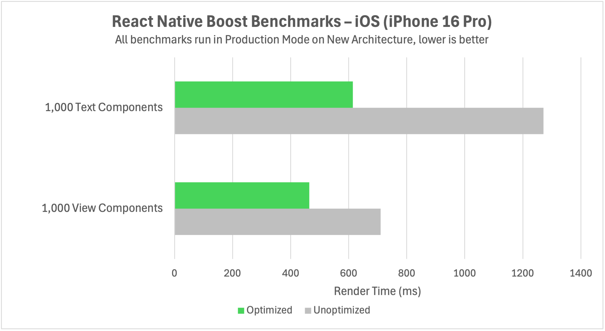
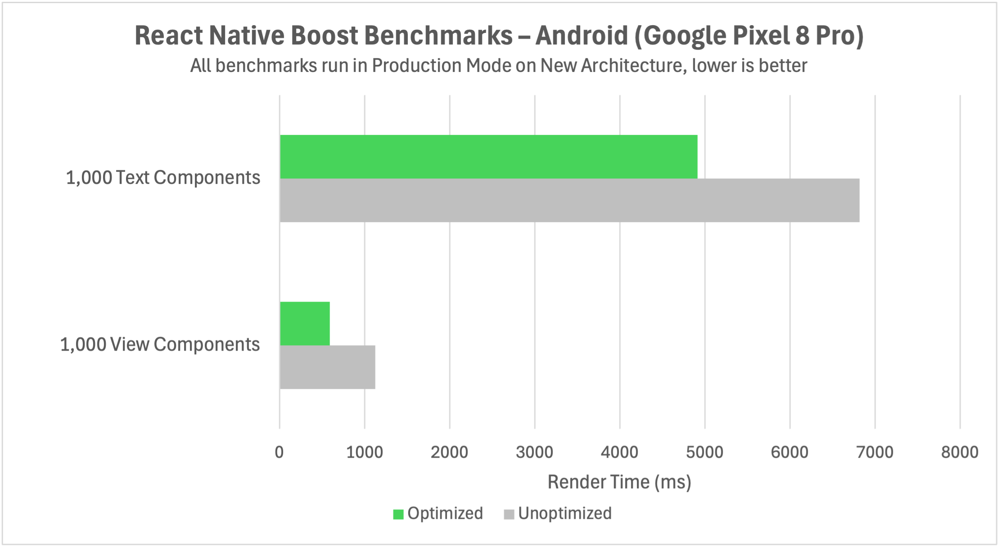

We run benchmarks with the example app available in the repository to measure render-time improvements.

In recent runs, React Native Boost improved rendering performance on both iOS and Android, with gains up to ~50%
depending on component mix and screen structure.

The more `Text` and `View` components your UI renders (especially in lists), the more measurable the gains are likely
to be.
