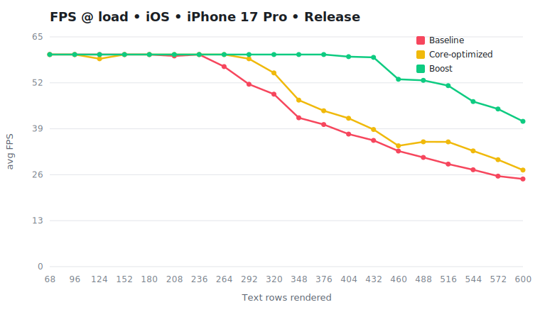
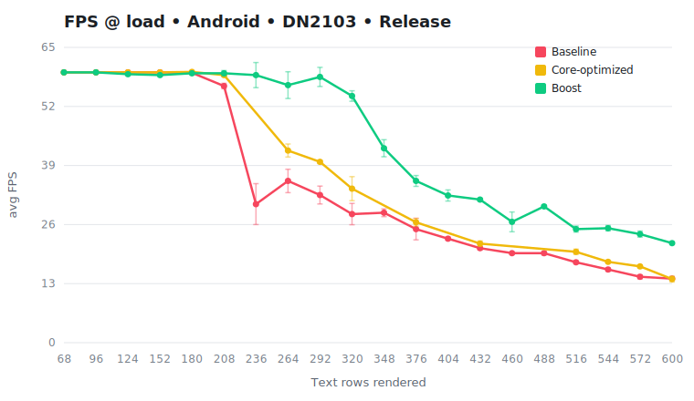
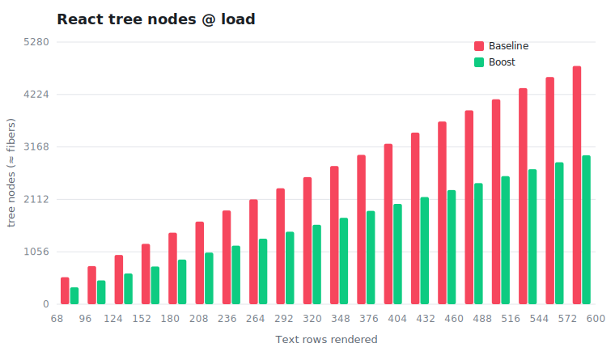

To show what that React Native Boost buys you,
the example app in the repository serves as a benchmark by rendering a heavy, constantly-updating screen and
measuring the **frame rate**, once with Boost **off** and once with Boost **on**, on the exact same code and
device.

Higher frames per second (FPS) means a smoother UI. The dotted ceiling is 60 FPS (one new frame every ~16 ms);
once the app can't keep up, FPS drops and the interface starts to stutter.

## Results

**iOS**: The baseline starts dropping frames early and falls to ~24 FPS under the heaviest load, while Boost
holds a solid 60 FPS far longer and stays roughly **66% faster** at the top end.

**Android**: Same shape, with Boost about **60% faster** at the heaviest load.

## Methodology

The test screen is a live crypto-style order book: two stacked columns of rows, each
row a few pieces of `Text`, all updating many times per second from a simulated price feed.

Each run is a clean A/B on identical inputs:

1. **Run the app twice**, once with React Native Boost disabled (the *baseline*), once with it enabled. Nothing else changes.
2. **Sweep the load.** For each version, the app steps through a range of row counts, from light to heavy.
3. **Measure FPS at each step.** The app runs a continuous animation loop and records how long every frame
   takes over a fixed window, then reports the average FPS (plus 95th-percentile frame time and the share of
   dropped frames).

Everything runs as a **release/production build on the New Architecture**.

### Secondary benchmark

There's also a second, device-independent measurement. For a single row, we count the **React tree nodes**
(fibers). One of the ways React Native Boost impacts an app's performance is by deleting a layer of these fibers per element it optimizes.

Fewer nodes means less for React to build and re-check on every frame.
