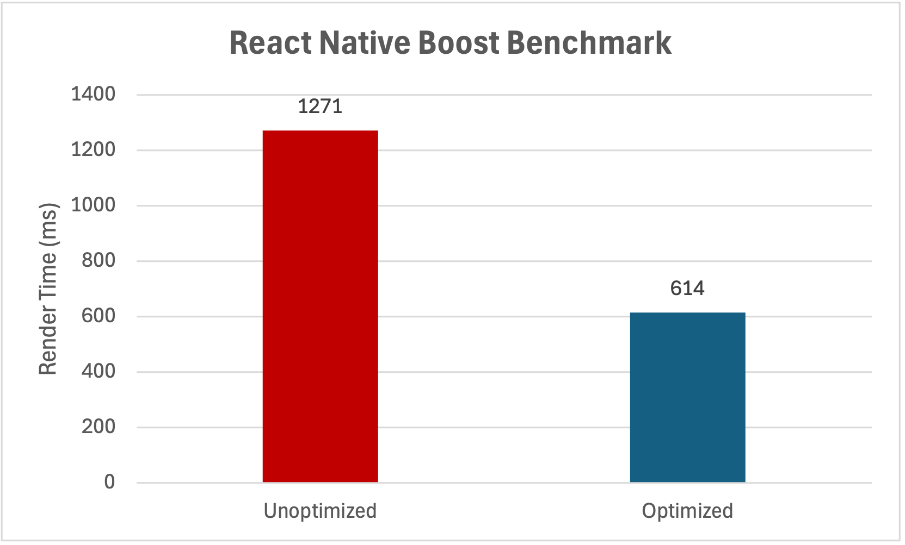

# Benchmarks

We run benchmarks from an example app included in the repository to test the performance of the plugin. In our benchmarks, we've seen rendering performance improve by around 50% for `Text` components and around 15% for `View` components.

**1,000 Text components**: Render time of 1,000 Text components with and without React Native Boost.
Measured in milliseconds on an iPhone 16 Pro running the example app in production mode and using New Architecture, lower is better.

The more you use `Text` and `View` components, the more you benefit from using React Native Boost. Especially inside lists, which typically use a lot of such components in multiple, sometimes hundreds or thousands of list items, the performance improvements can be significant.
