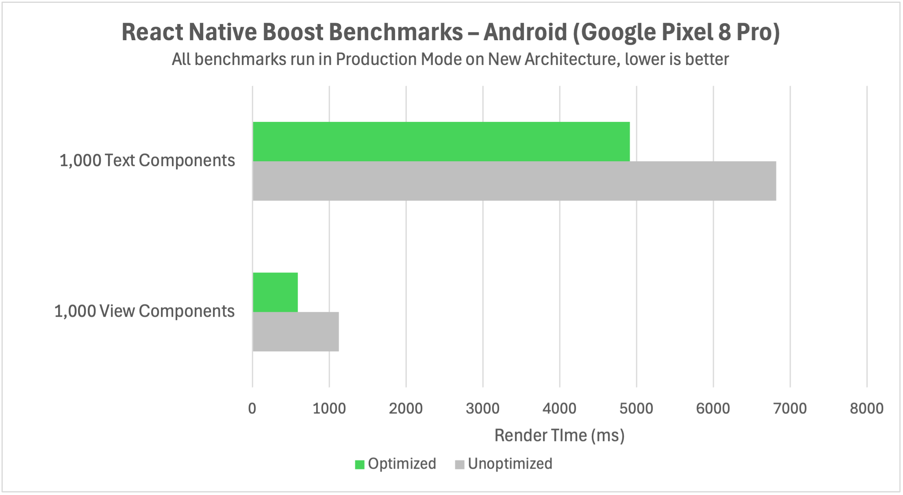

# Benchmarks

We run benchmarks from an example app included in the repository to test the performance of the plugin. In our benchmarks, we've seen rendering performance improve across the board for both iOS and Android, with improvements up to 50%.

The more you use `Text` and `View` components, the more you benefit from using React Native Boost. Especially inside lists, which typically use a lot of such components in multiple, sometimes hundreds or thousands of list items, the performance improvements can be significant.
