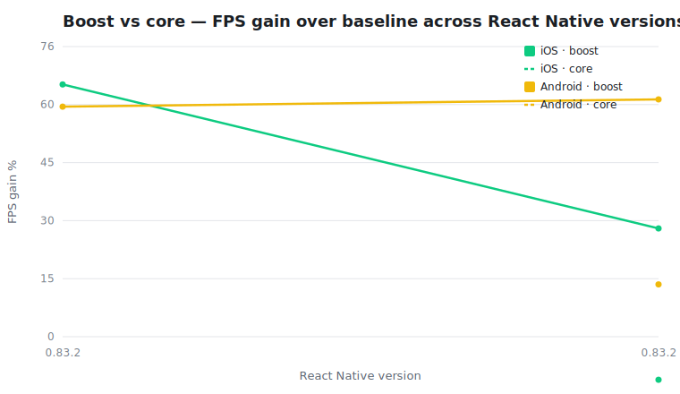

# React Native Boost — benchmark archive

Render-bound benchmark: a long, live-updating list whose rows are clusters of `Text` cells. Each
gain cell is `boost / core` at the run’s heaviest load — Boost vs baseline, and RN core’s own
overhead-reduction flags (`baseline-optimized`) vs baseline. The gap between them is how much of
Boost’s Text-FPS advantage core has yet to replicate (`—` = the run predates the core profile).

| RN | Boost | iOS gain (boost / core) | Android gain (boost / core) | Saved nodes/row |
| --- | --- | ---: | ---: | ---: |
| [0.83.2](./results/rn-0.83.2/boost-352421c/report.md) | 1.1.0 (`352421c`) | +28.2% / -11.2% | +61.8% / +13.6% | 3 |
| [0.83.2](./results/rn-0.83.2/boost-8545a48/report.md) | 1.1.0 (`8545a48`) | +69.1% / +11.6% | +55.3% / -0.7% | — |
| [0.83.2](./results/rn-0.83.2/boost-ab25510/report.md) | 1.1.0 (`ab25510`) | +65.7% / — | +59.9% / — | 3 |

<picture>
  <source media="(prefers-color-scheme: dark)" srcset="./graphs/trend.svg">
  
</picture>
