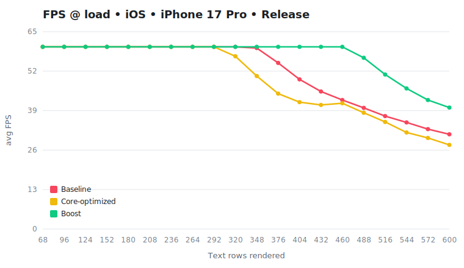
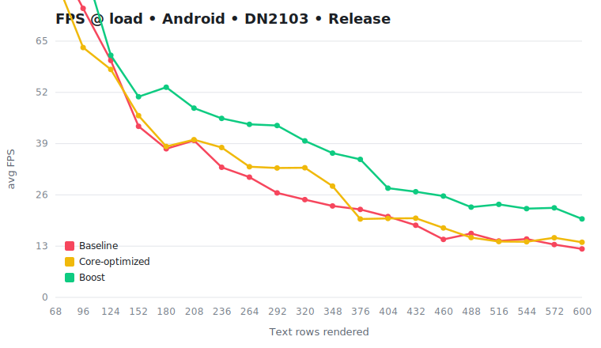

# Benchmark — RN 0.83.2 × Boost 1.1.0

- **React**: 19.2.0
- **Commit**: `352421c`
- **Captured**: 2026-06-21T18:53:17.993Z
- **Sweep**: 34, 48, 62, 76, 90, 104, 118, 132, 146, 160, 174, 188, 202, 216, 230, 244, 258, 272, 286, 300 rows/side · warmup 2000ms · capture 5000ms
- **Text rows** = rows mounted & reconciled each frame across both book sides (2× the per-side `--loads` sweep; only ~13/side are visible, the rest reconcile but clip off-screen)

## FPS

### iOS — iPhone 17 Pro (device, iOS 26.5.1), Release

Core-optimized FPS is anchored onto the baseline build via the flag-invariant Boost curve (§ anchor).

| Text rows | Baseline FPS | Core-opt FPS | Boost FPS | Core gain | Boost gain | Boost margin over core |
| ---: | ---: | ---: | ---: | ---: | ---: | ---: |
| 68 | 60 | 60 | 60 | +0.0% | +0.0% | +0.0% |
| 96 | 60 | 60 | 60 | +0.0% | +0.0% | +0.0% |
| 124 | 60 | 60 | 60 | +0.0% | +0.0% | +0.0% |
| 152 | 60 | 60 | 60 | +0.0% | +0.0% | +0.0% |
| 180 | 60 | 60 | 60 | +0.0% | +0.0% | +0.0% |
| 208 | 60 | 60 | 60 | +0.0% | +0.0% | +0.0% |
| 236 | 60 | 60 | 60 | +0.0% | +0.0% | +0.0% |
| 264 | 60 | 60 | 60 | +0.0% | +0.0% | +0.0% |
| 292 | 60 | 60 | 60 | +0.0% | +0.0% | +0.0% |
| 320 | 60 | 56.9 | 60 | -5.2% | +0.0% | +5.4% |
| 348 | 59.6 | 50.4 | 60 | -15.4% | +0.7% | +19.0% |
| 376 | 54.7 | 44.6 | 60 | -18.5% | +9.7% | +34.5% |
| 404 | 49.3 | 41.8 | 60 | -15.3% | +21.7% | +43.6% |
| 432 | 45.3 | 40.9 | 60 | -9.8% | +32.5% | +46.8% |
| 460 | 42.5 | 41.4 | 60 | -2.5% | +41.2% | +44.8% |
| 488 | 39.9 | 38.3 | 56.4 | -4.0% | +41.4% | +47.2% |
| 516 | 37.2 | 35.3 | 50.9 | -5.2% | +36.8% | +44.3% |
| 544 | 35.1 | 31.8 | 46.3 | -9.4% | +31.9% | +45.6% |
| 572 | 32.9 | 30 | 42.5 | -8.8% | +29.2% | +41.7% |
| 600 | 31.2 | 27.7 | 40 | -11.2% | +28.2% | +44.4% |

<picture>
  <source media="(prefers-color-scheme: dark)" srcset="./graphs/fps-ios.svg">
  
</picture>

### Android — DN2103 (device, Android 13), Release

Core-optimized FPS is anchored onto the baseline build via the flag-invariant Boost curve (§ anchor).

| Text rows | Baseline FPS | Core-opt FPS | Boost FPS | Core gain | Boost gain | Boost margin over core |
| ---: | ---: | ---: | ---: | ---: | ---: | ---: |
| 68 | 86.7 | 81 | 85.9 | -6.6% | -0.9% | +6.1% |
| 96 | 73.3 | 63.4 | 85.1 | -13.5% | +16.1% | +34.3% |
| 124 | 60.1 | 57.8 | 61.4 | -3.8% | +2.2% | +6.2% |
| 152 | 43.4 | 46.1 | 50.9 | +6.2% | +17.3% | +10.4% |
| 180 | 37.7 | 38.3 | 53.3 | +1.5% | +41.4% | +39.3% |
| 208 | 39.8 | 40 | 48 | +0.5% | +20.6% | +20.0% |
| 236 | 33 | 38 | 45.4 | +15.2% | +37.6% | +19.4% |
| 264 | 30.5 | 33.1 | 43.9 | +8.6% | +43.9% | +32.5% |
| 292 | 26.5 | 32.8 | 43.6 | +23.8% | +64.5% | +32.9% |
| 320 | 24.8 | 32.9 | 39.7 | +32.6% | +60.1% | +20.7% |
| 348 | 23.2 | 28.2 | 36.6 | +21.7% | +57.8% | +29.7% |
| 376 | 22.3 | 19.9 | 35 | -10.9% | +57.0% | +76.1% |
| 404 | 20.5 | 20 | 27.7 | -2.3% | +35.1% | +38.3% |
| 432 | 18.3 | 20.1 | 26.8 | +9.7% | +46.4% | +33.5% |
| 460 | 14.7 | 17.6 | 25.7 | +19.8% | +74.8% | +45.9% |
| 488 | 16.2 | 15.2 | 22.9 | -6.4% | +41.4% | +51.0% |
| 516 | 14.3 | 14.2 | 23.6 | -1.0% | +65.0% | +66.7% |
| 544 | 14.8 | 14.1 | 22.5 | -4.7% | +52.0% | +59.5% |
| 572 | 13.4 | 15.1 | 22.7 | +12.9% | +69.4% | +50.0% |
| 600 | 12.3 | 14 | 19.9 | +13.6% | +61.8% | +42.4% |

<picture>
  <source media="(prefers-color-scheme: dark)" srcset="./graphs/fps-android.svg">
  
</picture>

> **⚠ Anchor divergence** — the baseline and core builds drifted past tolerance; the anchored core gain is suspect at:

> - iOS — load 216: the two boost curves diverge 12.6% (> 8% tolerance) — anchored core gain is suspect
> - iOS — load 230: the two boost curves diverge 23.0% (> 8% tolerance) — anchored core gain is suspect
> - iOS — load 244: the two boost curves diverge 24.0% (> 8% tolerance) — anchored core gain is suspect
> - iOS — load 258: the two boost curves diverge 21.2% (> 8% tolerance) — anchored core gain is suspect
> - iOS — load 272: the two boost curves diverge 16.9% (> 8% tolerance) — anchored core gain is suspect
> - iOS — load 286: the two boost curves diverge 15.8% (> 8% tolerance) — anchored core gain is suspect
> - iOS — load 300: the two boost curves diverge 14.9% (> 8% tolerance) — anchored core gain is suspect
> - Android — load 146: the two boost curves diverge 12.4% (> 8% tolerance) — anchored core gain is suspect
> - Android — load 160: the two boost curves diverge 19.6% (> 8% tolerance) — anchored core gain is suspect
> - Android — load 188: the two boost curves diverge 10.4% (> 8% tolerance) — anchored core gain is suspect
> - Android — load 216: the two boost curves diverge 8.5% (> 8% tolerance) — anchored core gain is suspect
> - Android — load 286: the two boost curves diverge 12.9% (> 8% tolerance) — anchored core gain is suspect
> - Android — load 300: the two boost curves diverge 11.8% (> 8% tolerance) — anchored core gain is suspect

## Fibers

### Fiber savings — 8 → 5 nodes per row (saves 3)

| Text rows | Baseline nodes | Boost nodes | Saved | Reduction |
| ---: | ---: | ---: | ---: | ---: |
| 68 | 544 | 340 | 204 | +37.5% |
| 96 | 768 | 480 | 288 | +37.5% |
| 124 | 992 | 620 | 372 | +37.5% |
| 152 | 1216 | 760 | 456 | +37.5% |
| 180 | 1440 | 900 | 540 | +37.5% |
| 208 | 1664 | 1040 | 624 | +37.5% |
| 236 | 1888 | 1180 | 708 | +37.5% |
| 264 | 2112 | 1320 | 792 | +37.5% |
| 292 | 2336 | 1460 | 876 | +37.5% |
| 320 | 2560 | 1600 | 960 | +37.5% |
| 348 | 2784 | 1740 | 1044 | +37.5% |
| 376 | 3008 | 1880 | 1128 | +37.5% |
| 404 | 3232 | 2020 | 1212 | +37.5% |
| 432 | 3456 | 2160 | 1296 | +37.5% |
| 460 | 3680 | 2300 | 1380 | +37.5% |
| 488 | 3904 | 2440 | 1464 | +37.5% |
| 516 | 4128 | 2580 | 1548 | +37.5% |
| 544 | 4352 | 2720 | 1632 | +37.5% |
| 572 | 4576 | 2860 | 1716 | +37.5% |
| 600 | 4800 | 3000 | 1800 | +37.5% |

> RN-core overhead-reduction flags trim default _props_, not tree _nodes_, so **baseline-optimized has the same fiber count as baseline** — the structural saving Boost makes is core-only by construction.

<picture>
  <source media="(prefers-color-scheme: dark)" srcset="./graphs/fibers.svg">
  
</picture>

