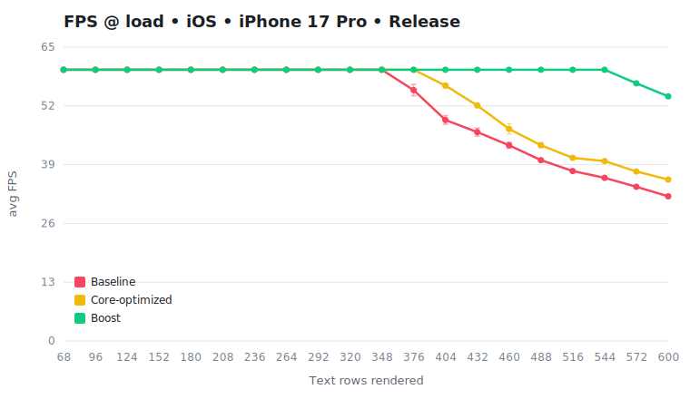

# Benchmark — RN 0.83.2 × Boost 1.1.0

- **React**: 19.2.0
- **Commit**: `8545a48`
- **Captured**: 2026-06-21T22:19:21.666Z
- **Sweep**: 34, 48, 62, 76, 90, 104, 118, 132, 146, 160, 174, 188, 202, 216, 230, 244, 258, 272, 286, 300 rows/side · warmup 2000ms · capture 5000ms
- **Text rows** = rows mounted & reconciled each frame across both book sides (2× the per-side `--loads` sweep; only ~13/side are visible, the rest reconcile but clip off-screen)

## FPS

### iOS — iPhone 17 Pro (device, iOS 26.5.1), Release

> Hottest device thermal level during capture: **nominal**.

> **✓ Validated** — every load passed: captures at the thermal floor, the flag-invariant Boost curves agree, and replicate spread is tight. Core-optimized FPS is the **direct** median (no anchor); chart whiskers show the replicate IQR.

| Text rows | Baseline FPS | Core-opt FPS | Boost FPS | Core gain | Boost gain | Boost margin over core |
| ---: | ---: | ---: | ---: | ---: | ---: | ---: |
| 68 | 60 | 60 | 60 | +0.0% | +0.0% | +0.0% |
| 96 | 60 | 60 | 60 | +0.0% | +0.0% | +0.0% |
| 124 | 60 | 60 | 60 | +0.0% | +0.0% | +0.0% |
| 152 | 60 | 60 | 60 | +0.0% | +0.0% | +0.0% |
| 180 | 60 | 60 | 60 | +0.0% | +0.0% | +0.0% |
| 208 | 60 | 60 | 60 | +0.0% | +0.0% | +0.0% |
| 236 | 60 | 60 | 60 | +0.0% | +0.0% | +0.0% |
| 264 | 60 | 60 | 60 | +0.0% | +0.0% | +0.0% |
| 292 | 60 | 60 | 60 | +0.0% | +0.0% | +0.0% |
| 320 | 60 | 60 | 60 | +0.0% | +0.0% | +0.0% |
| 348 | 60 | 60 | 60 | +0.0% | +0.0% | +0.0% |
| 376 | 55.5 | 60 | 60 | +8.1% | +8.1% | +0.0% |
| 404 | 48.9 | 56.5 | 60 | +15.5% | +22.7% | +6.2% |
| 432 | 46.2 | 52.1 | 60 | +12.8% | +29.9% | +15.2% |
| 460 | 43.3 | 46.9 | 60 | +8.3% | +38.6% | +27.9% |
| 488 | 40 | 43.3 | 60 | +8.2% | +50.0% | +38.6% |
| 516 | 37.6 | 40.5 | 60 | +7.7% | +59.6% | +48.1% |
| 544 | 36.1 | 39.8 | 60 | +10.2% | +66.2% | +50.8% |
| 572 | 34.1 | 37.5 | 57 | +10.0% | +67.2% | +52.0% |
| 600 | 32 | 35.7 | 54.1 | +11.6% | +69.1% | +51.5% |

<picture>
  <source media="(prefers-color-scheme: dark)" srcset="./graphs/fps-ios.svg">
  
</picture>

### Android — DN2103 (device, Android 13), Release

> Hottest device thermal level during capture: **nominal**.

> **⚠ Core-optimized validated at 15 of 20 loads.** The core series is shown only where the comparison is trustworthy and dropped (`—`) where it isn’t; Boost-vs-baseline is valid throughout. Dropped:

> - 236 rows: default/off replicate IQR 30% of median
> - 348 rows: Boost curves diverge 11.7% (> 8%)
> - 404 rows: Boost curves diverge 8.7% (> 8%)
> - 460 rows: Boost curves diverge 16.9% (> 8%)
> - 488 rows: Boost curves diverge 8.7% (> 8%)

| Text rows | Baseline FPS | Core-opt FPS | Boost FPS | Core gain | Boost gain | Boost margin over core |
| ---: | ---: | ---: | ---: | ---: | ---: | ---: |
| 68 | 59.5 | 59.5 | 59.5 | +0.0% | +0.0% | +0.0% |
| 96 | 59.5 | 59.5 | 59.5 | +0.0% | +0.0% | +0.0% |
| 124 | 59.5 | 59.5 | 59.1 | +0.0% | -0.7% | -0.7% |
| 152 | 59.5 | 59.5 | 58.9 | +0.0% | -1.0% | -1.0% |
| 180 | 59.4 | 59.6 | 59.3 | +0.3% | -0.2% | -0.5% |
| 208 | 56.5 | 58.9 | 59.3 | +4.2% | +5.0% | +0.7% |
| 236 | 30.5 | — | 58.9 | — | +93.1% | — |
| 264 | 35.6 | 42.3 | 56.7 | +18.8% | +59.3% | +34.0% |
| 292 | 32.5 | 39.8 | 58.5 | +22.5% | +80.0% | +47.0% |
| 320 | 28.3 | 33.9 | 54.3 | +19.8% | +91.9% | +60.2% |
| 348 | 28.6 | — | 42.8 | — | +49.7% | — |
| 376 | 25 | 26.5 | 35.6 | +6.0% | +42.4% | +34.3% |
| 404 | 22.9 | — | 32.4 | — | +41.5% | — |
| 432 | 20.8 | 21.8 | 31.5 | +4.8% | +51.4% | +44.5% |
| 460 | 19.7 | — | 26.6 | — | +35.0% | — |
| 488 | 19.7 | — | 30 | — | +52.3% | — |
| 516 | 17.7 | 20 | 25 | +13.0% | +41.2% | +25.0% |
| 544 | 16.1 | 17.8 | 25.2 | +10.6% | +56.5% | +41.6% |
| 572 | 14.5 | 16.8 | 23.9 | +15.9% | +64.8% | +42.3% |
| 600 | 14.1 | 14 | 21.9 | -0.7% | +55.3% | +56.4% |

<picture>
  <source media="(prefers-color-scheme: dark)" srcset="./graphs/fps-android.svg">
  
</picture>

