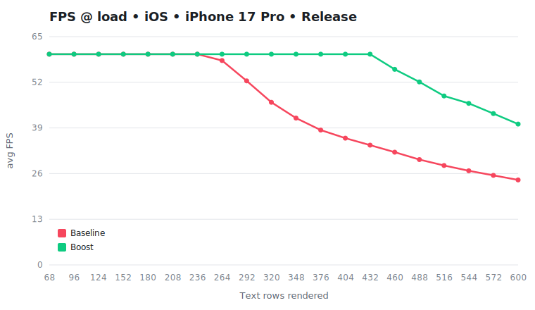
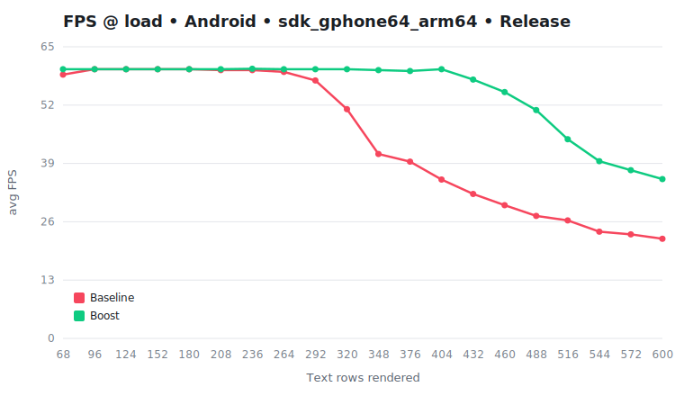

# Benchmark — RN 0.83.2 × Boost 1.1.0

- **React**: 19.2.0
- **Commit**: `ab25510`
- **Captured**: 2026-06-20T19:11:23.176Z
- **Sweep**: 34, 48, 62, 76, 90, 104, 118, 132, 146, 160, 174, 188, 202, 216, 230, 244, 258, 272, 286, 300 rows/side · warmup 2000ms · capture 5000ms
- **Text rows** = rows mounted & reconciled each frame across both book sides (2× the per-side `--loads` sweep; only ~13/side are visible, the rest reconcile but clip off-screen)

## FPS

### iOS — iPhone 17 Pro (simulator, iOS 26.4), Release

| Text rows | Baseline FPS | Boost FPS | Gain | Baseline p95 ms | Boost p95 ms | Dropped |
| ---: | ---: | ---: | ---: | ---: | ---: | :--- |
| 68 | 60 | 60 | +0.0% | 16.7 | 16.7 | 0% → 0% |
| 96 | 60 | 60 | +0.0% | 16.7 | 16.7 | 0% → 0% |
| 124 | 60 | 60 | +0.0% | 16.7 | 16.7 | 0% → 0% |
| 152 | 60 | 60 | +0.0% | 16.7 | 16.8 | 0% → 0% |
| 180 | 60 | 60 | +0.0% | 16.7 | 16.8 | 0% → 0% |
| 208 | 60 | 60 | +0.0% | 16.7 | 16.7 | 0% → 0% |
| 236 | 60 | 60 | +0.0% | 18.2 | 17.1 | 0% → 0% |
| 264 | 58.2 | 60 | +3.1% | 19.6 | 16.8 | 0% → 0% |
| 292 | 52.4 | 60 | +14.5% | 21.5 | 17.1 | 0% → 0% |
| 320 | 46.3 | 60 | +29.6% | 29.4 | 17.2 | 2.2% → 0% |
| 348 | 41.8 | 60 | +43.5% | 29.8 | 17.2 | 4.3% → 0% |
| 376 | 38.4 | 60 | +56.3% | 30.7 | 18 | 8.8% → 0% |
| 404 | 36.1 | 60 | +66.2% | 30.6 | 19.4 | 6.1% → 0% |
| 432 | 34.1 | 60 | +76.0% | 32.2 | 20 | 38.6% → 0% |
| 460 | 32.1 | 55.7 | +73.5% | 34.2 | 21.7 | 56.5% → 0% |
| 488 | 30 | 52.1 | +73.7% | 36.1 | 22.9 | 95.4% → 0% |
| 516 | 28.3 | 48.1 | +70.0% | 38.2 | 25.3 | 100% → 0% |
| 544 | 26.8 | 46 | +71.6% | 40.1 | 25.9 | 100% → 0% |
| 572 | 25.5 | 43.1 | +69.0% | 42.2 | 28.2 | 100% → 0% |
| 600 | 24.2 | 40.1 | +65.7% | 44.3 | 28.7 | 100% → 0.5% |

<picture>
  <source media="(prefers-color-scheme: dark)" srcset="./graphs/fps-ios.svg">
  
</picture>

### Android — sdk_gphone64_arm64 (emulator, Android 16), Release

| Text rows | Baseline FPS | Boost FPS | Gain | Baseline p95 ms | Boost p95 ms | Dropped |
| ---: | ---: | ---: | ---: | ---: | ---: | :--- |
| 68 | 58.8 | 60 | +2.0% | 19.1 | 19 | 0.3% → 0% |
| 96 | 60 | 60 | +0.0% | 19 | 19 | 0% → 0% |
| 124 | 60 | 60 | +0.0% | 20.5 | 19.6 | 0% → 0% |
| 152 | 60 | 60 | +0.0% | 19.4 | 20 | 0% → 0% |
| 180 | 60 | 60 | +0.0% | 18.6 | 19 | 0% → 0% |
| 208 | 59.8 | 60 | +0.3% | 19.7 | 20.1 | 0.3% → 0% |
| 236 | 59.8 | 60.1 | +0.5% | 20.5 | 19.2 | 0% → 0% |
| 264 | 59.4 | 60 | +1.0% | 21.1 | 19.5 | 0% → 0% |
| 292 | 57.5 | 60 | +4.3% | 23.7 | 20.1 | 1% → 0% |
| 320 | 51.1 | 60 | +17.4% | 28 | 21.1 | 2.3% → 0% |
| 348 | 41.1 | 59.8 | +45.5% | 30 | 21.1 | 4.4% → 0% |
| 376 | 39.4 | 59.6 | +51.3% | 31.3 | 21.5 | 7.6% → 0.3% |
| 404 | 35.4 | 60 | +69.5% | 34.3 | 22.4 | 30.7% → 0% |
| 432 | 32.2 | 57.7 | +79.2% | 35.7 | 23.8 | 58% → 0% |
| 460 | 29.7 | 54.9 | +84.8% | 37.8 | 25.6 | 89.9% → 1.1% |
| 488 | 27.3 | 50.9 | +86.4% | 41.8 | 26.5 | 100% → 0% |
| 516 | 26.3 | 44.4 | +68.8% | 41.6 | 29.1 | 100% → 2.7% |
| 544 | 23.8 | 39.5 | +66.0% | 53.5 | 30.9 | 100% → 6.6% |
| 572 | 23.2 | 37.5 | +61.6% | 47.9 | 33.5 | 100% → 23.4% |
| 600 | 22.2 | 35.5 | +59.9% | 49.6 | 34.6 | 100% → 30.3% |

<picture>
  <source media="(prefers-color-scheme: dark)" srcset="./graphs/fps-android.svg">
  
</picture>

## Fibers

### Fiber savings — 8 → 5 nodes per row (saves 3)

| Text rows | Baseline nodes | Boost nodes | Saved | Reduction |
| ---: | ---: | ---: | ---: | ---: |
| 68 | 544 | 340 | 204 | +37.5% |
| 96 | 768 | 480 | 288 | +37.5% |
| 124 | 992 | 620 | 372 | +37.5% |
| 152 | 1216 | 760 | 456 | +37.5% |
| 180 | 1440 | 900 | 540 | +37.5% |
| 208 | 1664 | 1040 | 624 | +37.5% |
| 236 | 1888 | 1180 | 708 | +37.5% |
| 264 | 2112 | 1320 | 792 | +37.5% |
| 292 | 2336 | 1460 | 876 | +37.5% |
| 320 | 2560 | 1600 | 960 | +37.5% |
| 348 | 2784 | 1740 | 1044 | +37.5% |
| 376 | 3008 | 1880 | 1128 | +37.5% |
| 404 | 3232 | 2020 | 1212 | +37.5% |
| 432 | 3456 | 2160 | 1296 | +37.5% |
| 460 | 3680 | 2300 | 1380 | +37.5% |
| 488 | 3904 | 2440 | 1464 | +37.5% |
| 516 | 4128 | 2580 | 1548 | +37.5% |
| 544 | 4352 | 2720 | 1632 | +37.5% |
| 572 | 4576 | 2860 | 1716 | +37.5% |
| 600 | 4800 | 3000 | 1800 | +37.5% |

<picture>
  <source media="(prefers-color-scheme: dark)" srcset="./graphs/fibers.svg">
  
</picture>

